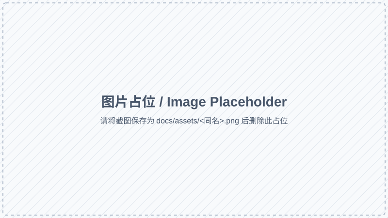

# Vision Train 文档

> YOLO 目标检测 **数据集 · 训练 · 评估** 一体化工作台

Vision Train 是一个面向 YOLO 目标检测项目的本地工作台，覆盖数据采集、标注、自动标注、训练、评估、导出的完整闭环。前端基于 Vue 3 + Vite，后端基于 Flask + Ultralytics，推荐直接在宿主机原生运行。

  <h1>Vision Train</h1>
  
数据集 · 训练 · 评估 一体化工作台

  

    <a class="primary" href="/guide/quickstart">快速开始</a>
    <a href="/sop/01-project">查看 SOP</a>
    <a href="/reference/api">API 参考</a>
  

## 适合谁用

- 需要快速把一批图片/视频变成 YOLO 可训练数据集的算法工程师
- 想以 Web UI 集中管理多项目、各自的训练与评估
- 需要把训练、评估、导出串成可复现 SOP 的项目组

## 你能用它做什么

| 模块       | 关键能力                                                         |
| ---------- | ---------------------------------------------------------------- |
| 项目管理   | 多项目、目录式管理，支持扫描已有 YOLO 数据集                    |
| 数据准备   | 视频抽帧、上传图片、删除/批量删除、合并数据集                    |
| 标注       | 可视化标注、自动标注（基于已训练模型）、标签重排、删除单类      |
| 数据增强   | 弱类补偿采样（目标类复制 + 非目标类下采样 + 翻转增强）           |
| 训练       | Ultralytics YOLO 训练，Cosine LR / Mosaic / Mixup 等策略可调     |
| 评估       | mAP50/50-95、训练曲线、产物图                                    |
| 导出       | ONNX / OpenVINO（FP16、INT8 校准）                              |
| API        | 所有功能可 HTTP 化调用，便于嵌入 CI/CD                           |

## 阅读路径

1. 先看 [快速开始](guide/quickstart) 把环境跑起来
2. 按 [SOP](sop/01-project) 的 1→8 顺序操作一遍完整流程
3. 需要调整路径或端口时再看 [运行配置](deploy/config)
4. 集成/二次开发参考 [API 参考](reference/api)

> 如果这是你第一次接触 Vision Train，强烈建议先把 [产品架构](guide/architecture) 看一遍，再进入 SOP。
