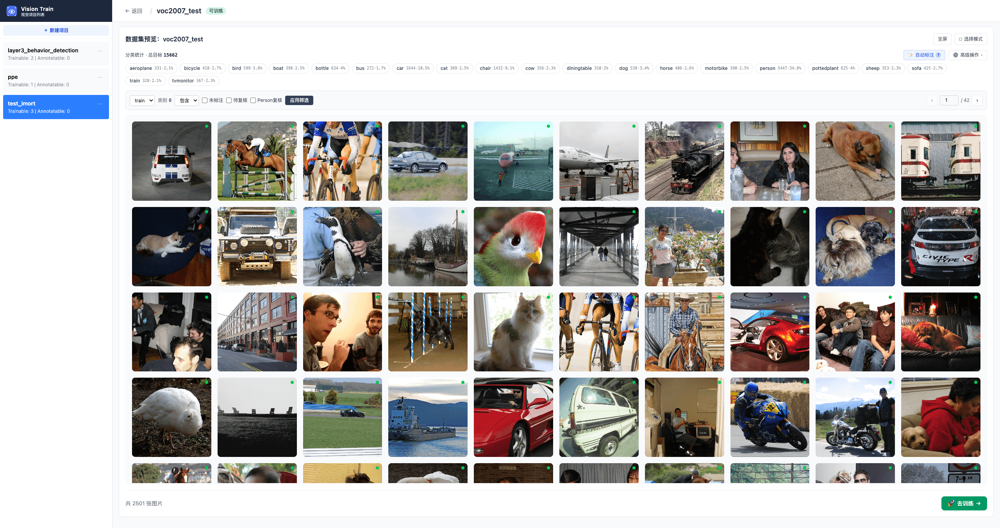
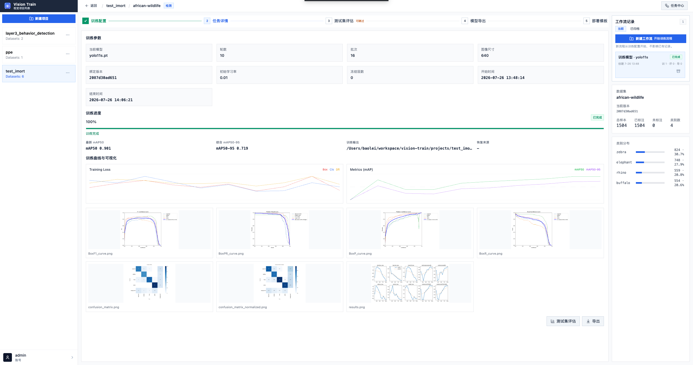

# Vision Train 文档

> 从数据准备到模型导出的一体化工作台

Vision Train 面向需要快速整理图片与视频、完成标注、训练模型并导出结果的团队。系统以“项目”为根上下文，把数据、训练流程和任务状态统一收口在同一套 Web UI 中。

  <h1>Vision Train</h1>
  
从数据准备到模型导出的一体化工作台

  

    <a class="primary" href="#/guide/quickstart">快速开始</a>
    <a href="#/sop/01-project">查看 SOP</a>
  

## 核心流程示意

下面这张示例图展示了训练工作流的核心界面。用户可以直观看到训练参数、任务详情、测试评估、模型导出、部署模板的主链路，这也是 Vision Train 最核心的一条使用路径。

## 适合谁用

- 需要把图片或视频快速整理成可训练数据的团队
- 需要在一个界面里集中管理多个项目、数据和训练流程的项目组
- 希望把标注、训练、测试和导出串成稳定交付流程的团队

## 当前版本能做什么

围绕一个完整的视觉模型训练闭环：项目 → 数据集 → 标注 → 训练工作流 → 评估 / 导出 / 部署模板。

### 数据准备

| 模块 | 关键能力 |
| --- | --- |
| 项目管理 | 新建、编辑、删除、切换项目，按项目隔离数据与训练记录 |
| 数据准备 | 导入现成数据、整理训练数据划分、下载或删除数据集 |
| 视频处理 | 上传视频、预览视频、抽取候选图片并导入到数据集中 |
| 图片标注 | 框选目标、修改类别、删除错误标注、批量清理图片 |
| 智能辅助 | 用已有模型先生成标注草稿，再由人工复核确认 |
| 数据整理 | 调整类别顺序、清理重复图片、合并数据集、删除无用标签 |
| 数据增强 | 针对样本少的类别生成补强数据集，减少类别不平衡 |
| 数据集版本 | 发布 / 恢复 / 自动引导数据集版本快照 |

### 模型训练与上线

| 模块 | 关键能力 |
| --- | --- |
| 模型训练 | 以工作流为中心管理多轮训练，跨任务类型（detect / classify / segment / pose） |
| 效果检查 | 查看测试结果，判断当前模型是否达到使用预期 |
| 模型导出 | 生成适合不同部署环境的模型文件并下载产物 |
| 部署模板 | 基于 `pt` 或导出后产物生成 FastAPI / Python SDK / 批处理模板包 |
| 工作流归档 | 归档 / 恢复训练工作流，保留历史任务与产物 |
| 任务中心 | 统一查看抽帧、标注、训练、测试、导出、部署模板等后台任务状态 |

## 推荐阅读顺序

1. 先看 [快速开始](guide/quickstart) 把前后端跑起来
2. 按 [SOP](sop/01-project) 的顺序走一遍完整闭环
3. 需要调整环境变量、路径或端口时查看 [运行配置](deploy/config)
4. 需要做系统对接时再查看 [API 参考](reference/api)

## 一条完整使用路径

1. 登录系统并进入目标项目
2. 通过“导入数据集”或“上传视频 -> 抽帧导入”准备数据
3. 在数据集详情页完成标注、自动标注复核、数据整理和数据集版本管理
4. 进入训练页，新建一条训练工作流并启动训练
5. 训练完成后查看测试评估结果
6. 根据使用场景导出模型，或直接生成 FastAPI / Python SDK / 批处理 部署模板
7. 当迭代轮换时，归档当前工作流并按需恢复
8. 在任务中心统一回看所有后台任务的状态与错误信息

> 如果你是第一次使用，建议至少先读完 [快速开始](guide/quickstart) 和 [SOP-1 项目管理](sop/01-project)。
