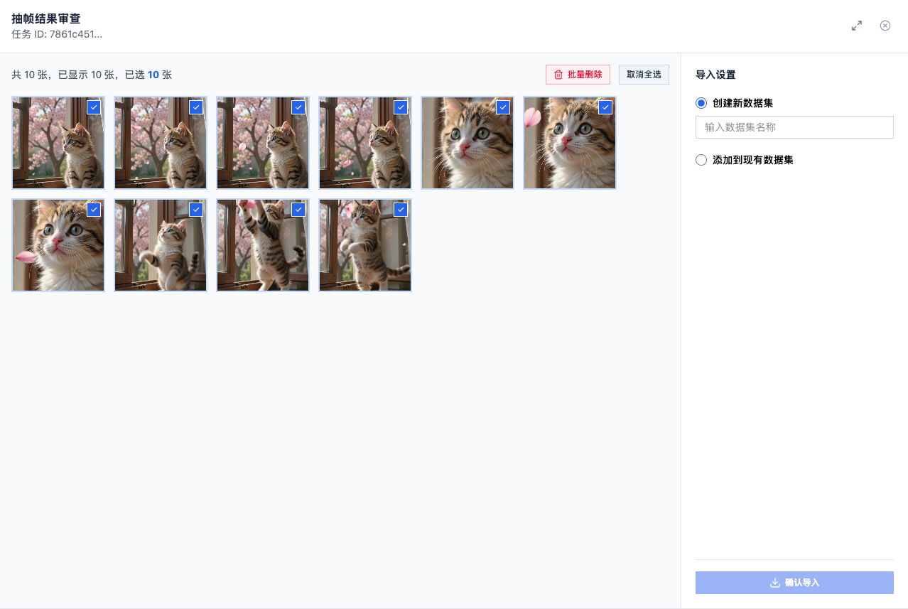

# SOP-2 视频抽帧

> 把视频沉淀成可训练的图片素材，并通过任务中心跟踪全过程。

## 2.1 目标

让读者理解：

- 抽帧的输入、输出与适用场景
- 抽帧策略与产物之间的关系
- 任务中心的统一回看方式


> 上图展示了一次抽帧任务完成后对结果的审查与导入设置：左侧是候选帧缩略图，右侧是导入设置（创建新数据集 / 追加到现有数据集）。

## 2.2 前置条件

- 已进入目标项目（参见 [SOP-1 项目管理](01-project.md)）。
- 机器已安装 `ffmpeg` / `ffprobe`，否则抽帧任务无法启动。
- 决定抽帧结果要导入到哪个数据集；没有目标数据集也可以在抽帧完成后直接生成新数据集。

## 2.3 业务动作

### 上传视频

把视频原文件写入 `projects/<project>/videos/`。常见视频容器（mp4 / mov / avi / mkv / webm）均受支持。

### 发起抽帧

针对一段视频发起一次抽帧任务，结果暂存于 `projects/<project>/temp_tasks/<task_id>/`。**未导入数据集之前，这些图片不会进入 `training/`**，所以抽错了可以放心重来。

### 抽帧策略

| 策略 | 语义 |
| --- | --- |
| 按时间间隔抽帧 | 每隔一段时间抽一张 |
| 按目标张数抽帧 | 自动估算采样间隔，目标张数优先 |

经验上：

- 短试抽时设稀一点，避免大量相似帧。
- 视频很长时先做一轮保守抽帧，便于控制审查成本。

### 审查与筛选

只在任务结果区临时存在。建议优先清理：模糊帧、几乎重复的相邻帧、没有目标的帧。

### 导入数据集

把保留的图片落地到 `projects/<project>/training/<dataset_name>/` 下，目录结构遵循标准 YOLO 布局，并补齐 `dataset.yaml`。导入到现有数据集时图片会写入对应 split。新导入的图片默认无人工标签，需要继续走 [SOP-3 数据标注](03-annotation.md)。

> 系统会为数据集写入首个 `current_version_id` 快照（参见 §2.6）。

## 2.4 任务状态与失败排查

### 任务状态

抽帧任务的标准状态机：

- `pending`：等待调度
- `running`：正在抽帧
- `completed`：抽帧完成，可审查
- `failed`：抽帧失败，附带错误信息
- `cancelled`：被取消

### 任务中心回看

希望跨任务统一回看时，从任务中心进入。任务中心只读取已有任务记录，不产生新的数据落点；任务类型覆盖抽帧 / 标注 / 训练 / 评估 / 导出 / 部署模板。

### 删除任务的影响

如果任务尚未导入数据集，临时抽帧结果会一起清理；如果已经导入数据集，仅清理临时结果，已导入的图片不会被回删。

## 2.5 数据落点总览

```text
projects/<project>/
├── videos/                          # 视频原文件
├── temp_tasks/<task_id>/            # 抽帧任务临时结果
└── training/<dataset_name>/         # 导入后的目标数据集
```

## 2.6 与数据集版本的联动

- 数据集首次接收导入内容时，系统会写入第一个 `current_version_id` 快照。
- 后续导入新内容会沿用同一数据集，不再自动发布新版本；如需把变更沉淀成历史快照，使用 SOP-3 描述的发布版本能力。

## 2.7 失败排查

| 现象 | 排查方向 |
| --- | --- |
| 上传后无视频 | 确认上传格式受支持，文件未损坏 |
| 抽帧启动即失败 | 检查 `ffmpeg` / `ffprobe` 是否可执行 |
| 抽帧结果很少 | 策略偏稀，调整间隔或目标张数 |
| 导入后无法训练 | 数据集只有图片，需要继续走 SOP-3 标注 |

## 2.8 相关 SOP

- [SOP-3 数据标注](03-annotation.md)
- [SOP-7 模型训练](07-train.md)